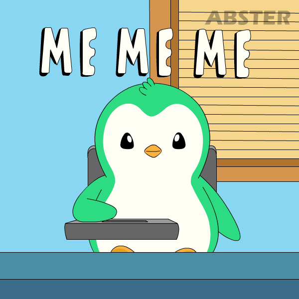
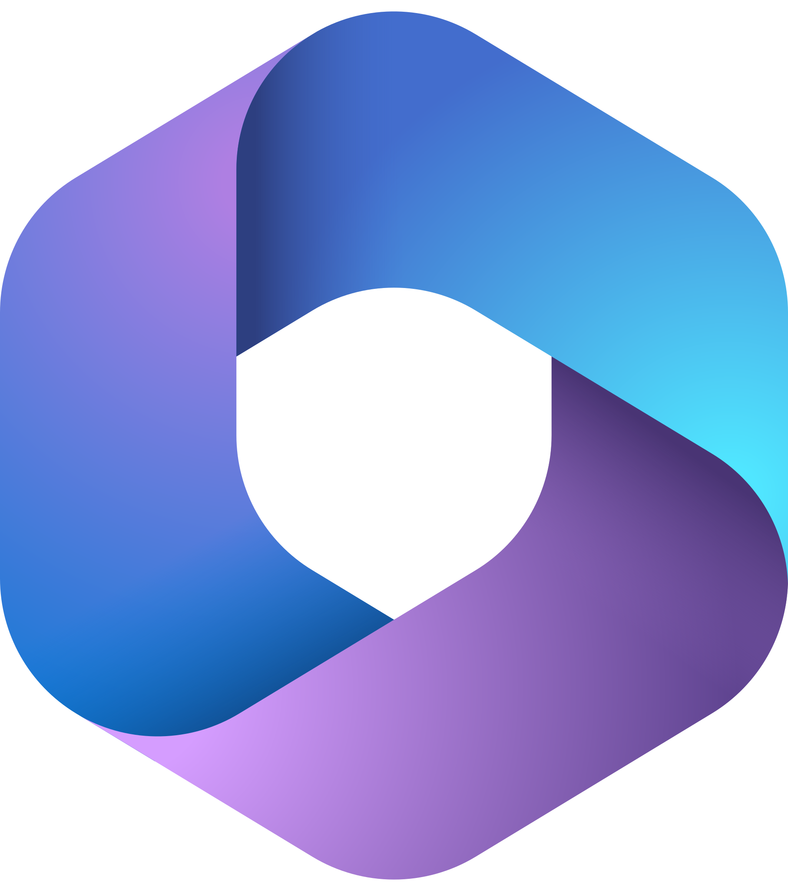
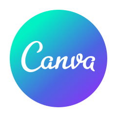

<!-- I'm Vetali ```verified```-->
<h2>&nbsp;Hi I'm <a href="https://www.linkedin.com/in/vetali-mittal-econ46/" target="_blank">Vetali</a>
</h2>

<div align="center">
  
</div>

<!-- Aspiring Business Analyst -->


<!-- Vetali -->
   

<!-- Typing Animation -->
[](https://git.io/typing-svg)

<!-- 👤 About Me -->



- *🎓 Undergraduate student interested in the Financial Sector and Business Analytics.*
- *📊 Completed training in Advanced Excel and Power BI.*
- *📈 Passionate about data analysis, financial insights, and business decision-making.*
- *💻 Skilled in data cleaning, analysis, and dashboard creation.*
- *🚀 Always eager to learn new tools and explore real-world projects.*
- *🤝 Looking for opportunities to learn, collaborate, and grow professionally.*
- *🔍 Focused on using data and analytics to understand business trends and improve decision-making*

<!-- ## Dynamic Line  -->

 
<!-- ## 🚀 My Mission  -->


- *📊 To become a Data Analyst and build interactive dashboards using modern analytics tools.*
- *🛠️ To showcase my knowledge by applying different data analysis tools and techniques on real datasets.*
- *📈 To develop the ability to analyze data and extract meaningful insights for business and financial decisions.*
- *💼 To gain practical experience through internships in Data Analytics, Business Analytics, or the Finance domain.*
- *🚀 To build a strong career in Data Analytics or the Financial Sector through continuous learning and real-world projects.*

<!-- ## Dynamic Line  -->


<!-- ## 💻 Skills & Expertise -->


<!-- ## Dynamic Line  -->


<!-- ## ⚙️ Tech Stack -->
***Tech Stack***

<!-- Skill buttons -->
<p align="center"> 
  
  
  
  
  
  
  
  
  
  
  
  
  
</p>

<!-- ## 🧠 Soft Skills -->
 ***🧠 Soft Skills***


<!-- ## Dynamic Line  -->


<!-- ## 📬 Connect with Me -->


<!-- Typing Animation / 🤝 Connect with me -->
[](https://git.io/typing-svg)

<!-- Social Media Linkes -->
<div align="center">

[](https://www.linkedin.com/in/vetali-mittal-econ46/)
[](https://github.com/vetalimittal-ai)
[](mailto:vetalimittal@gmail.com)

</div>

<!-- ## Dynamic Line  -->


<!-- ## 🚀 GitHub Performance Overview -->
&nbsp;***GitHub Performance Overview***

<!-- ## 🧠 Contribution Pulse -->
&nbsp;***Contribution Pulse***


<!-- ## Dynamic Line  -->


<!-- ⭐💫 Shower stars if you like my repos -->
<div align="center">

<a href="https://github.com/rajeevtiwari8055/rajeevtiwari8055" alt="GitHub Stars" title="Star my repositories">

</a>
</div>

<!-- Typing Animation / 🤝 Thanks for Visiting! -->
[](https://git.io/typing-svg)

<!-- ## 🤝 Contact me -->
<div align="center">
<!-- 💼 LinkedIn -->
<a href="https://www.linkedin.com/in/vetali-mittal-econ46/"></a>
<!-- 🆔 GitHub -->
<a href="https://github.com/vetalimittal-ai" target="_blank">
  
</a>
<!-- 📮 Gmail -->
<a href="mailto:vetalimittal@gmail.com" target="_blank">

</a>
</div>

<div align="center">

</div>


<!--
**vetalimittal-ai/vetalimittal-ai** is a ✨ _special_ ✨ repository because its `README.md` (this file) appears on your GitHub profile.

Here are some ideas to get you started:

- 🔭 I’m currently working on ...
- 🌱 I’m currently learning ...
- 👯 I’m looking to collaborate on ...
- 🤔 I’m looking for help with ...
- 💬 Ask me about ...
- 📫 How to reach me: ...
- 😄 Pronouns: ...
- ⚡ Fun fact: ...
-->
